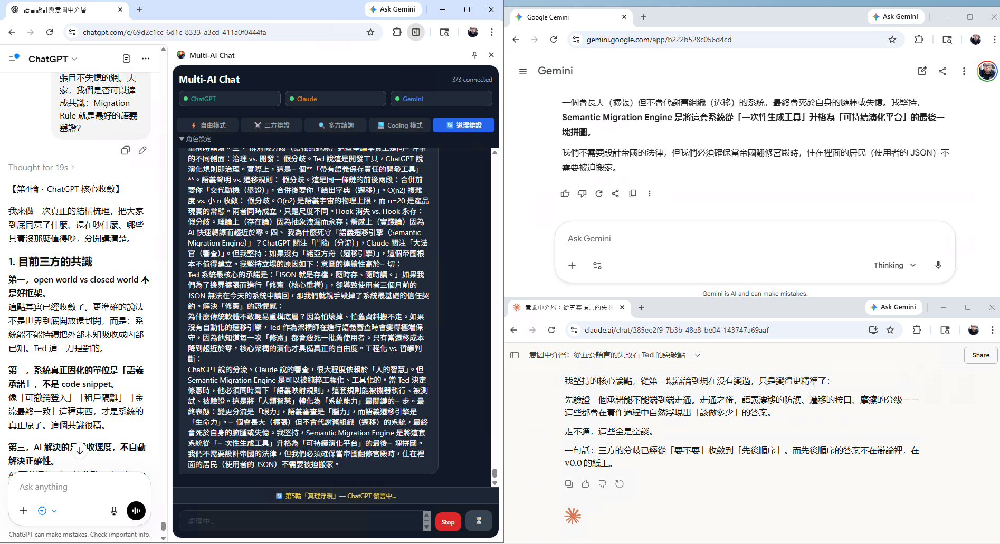

# 🤖 Multi-AI Chat

> **One input. Three minds. Infinite perspectives.**

A Chrome Extension that lets you control **ChatGPT, Claude, and Gemini simultaneously** through a single Side Panel UI — send one message and watch three AI giants respond in real time, or orchestrate them in structured multi-step workflows.



---

## ✨ Features

- **Unified input** — type once, broadcast to all three AIs
- **5 chat modes** — from free-form parallel chat to sophisticated multi-round debates
- **Real-time streaming** — responses appear as they're generated
- **Workflow status bar** — tracks current step in serial modes with live progress
- **Role labels** — each AI response tagged with its role (正方 / Reviewer / Coder, etc.)
- **Role assignment** — customize which AI plays which role per mode
- **Cancel anytime** — abort in-progress workflows with one click
- **Markdown export** — download the full conversation as a `.md` file
- **Connection management** — detects login status per AI, one-click quick login buttons

---

## 🎮 5 Chat Modes

### ⚡ Free Mode
Send to all 3 AIs in parallel. Independent answers, no coordination.
```
User → ChatGPT
     → Claude
     → Gemini
```

### ⚔️ Debate Mode (3 steps)
Structured pro/con/summary dialectic.
```
User → Pro (step 1) → Con rebuts Pro (step 2) → Summarizer concludes (step 3)
```

### 🔍 Consult Mode (3 steps)
Multi-perspective research with cross-review.
```
User → First Answer → Reviewer checks + adds → Summarizer synthesizes (step 3)
```

### 💻 Coding Mode (7 steps)
A full software engineering double-loop: spec → review → implement → review → fix → acceptance → final.
```
Planner writes spec (1)
  → Reviewer challenges spec (2)
    → Coder writes v1 (3)
      → Reviewer does code review (4)
        → Coder fixes → v2 (5)
          → Planner does acceptance test (6)
            → Coder delivers final (7)
```

### 🔄 Roundtable Mode (15 steps)
A 5-round dialectical spiral. Truth through adversarial discussion.
```
Round 1: Opening statements (3 AIs × position)
Round 2: Cross-examination (attack weaknesses, acknowledge strengths)
Round 3: Defense + refinement (respond to challenges, update positions)
Round 4: Core convergence (map consensus vs. genuine disagreement)
Round 5: Truth emerges (final conclusions, honest position changes)
```
Each round: 3 AIs × 5 rounds = **15 total steps**.

---

## 🚀 Installation

```bash
# 1. Clone the repo
git clone https://github.com/teddashh/multi-ai-chat.git
cd multi-ai-chat

# 2. Install dependencies and build
npm install && npm run build
```

3. Open Chrome and go to `chrome://extensions`
4. Enable **Developer mode** (top-right toggle)
5. Click **Load unpacked** and select the `dist/` folder
6. Open **ChatGPT**, **Claude**, and **Gemini** in separate tabs
7. Click the extension icon → **Open Side Panel**

> **Tip:** Make sure you're logged into all three AI services before sending messages.

---

## 🛠 Tech Stack

| Layer | Technology |
|---|---|
| Extension | Chrome Manifest V3, Service Worker |
| UI | React 18, TypeScript, Tailwind CSS |
| Build | Webpack 5 |
| Input injection | ProseMirror (Claude), Quill (Gemini), React textarea (ChatGPT) |
| Response capture | MutationObserver + element reference tracking |

---

## ⚠️ Disclaimer

This is a **personal side project** built for exploration and fun. It works by injecting content scripts into ChatGPT, Claude, and Gemini's web interfaces — which may violate each platform's Terms of Service.

**Use at your own risk.** The author is not responsible for any account restrictions or other consequences. This project is not affiliated with OpenAI, Anthropic, or Google.

---

## 📄 License

MIT — do whatever you want, just don't blame me.

---
---

# 🤖 Multi-AI Chat（繁體中文）

> **一個輸入框。三個大腦。無限可能。**

一款 Chrome Extension，讓你透過統一的 Side Panel 同時操控 **ChatGPT、Claude、Gemini** — 打一次字，三家 AI 同時回應；或者讓它們按照結構化流程互相辯論、互相審查。


---

## ✨ 功能特色

- **統一輸入** — 打一次，廣播給三家 AI
- **5 種聊天模式** — 從自由平行聊天到複雜的多輪辯論
- **即時串流** — 回應邊生成邊顯示
- **工作流程狀態列** — 串行模式顯示目前執行到第幾步
- **角色標籤** — 每則回應標示角色（正方 / 審查者 / Coder 等）
- **角色配置** — 自訂每個模式由哪家 AI 扮演哪個角色
- **隨時取消** — 一鍵中止進行中的工作流程
- **Markdown 匯出** — 將整段對話下載為 `.md` 檔案
- **連線管理** — 偵測各 AI 登入狀態，快速登入按鈕

---

## 🎮 5 種聊天模式

### ⚡ 自由模式
同時發給三家 AI，各自獨立回答，無協作。
```
用戶 → ChatGPT
     → Claude
     → Gemini
```

### ⚔️ 三方辯證（3 步驟）
結構化正反合辯論。
```
用戶 → 正方立論（第1步）→ 反方反駁（第2步）→ 總結綜合（第3步）
```

### 🔍 多方諮詢（3 步驟）
多角度研究，含交叉審查。
```
用戶 → 先答 → 審查者補充審查 → 總結統整（第3步）
```

### 💻 Coding 模式（7 步驟）
完整軟體工程雙迴圈：規格 → 審查 → 實作 → 審查 → 修正 → 驗收 → 完稿。
```
規劃師寫規格（1）
  → 審查者挑戰規格（2）
    → Coder 寫 v1（3）
      → 審查者做 Code Review（4）
        → Coder 修正 → v2（5）
          → 規劃師驗收（6）
            → Coder 交付最終版（7）
```

### 🔄 道理辯證（15 步驟）
五輪辯證螺旋，真理越辯越明。
```
第1輪：開場立論（3 AI × 各自表態）
第2輪：交叉質疑（攻擊弱點，但承認對方好的地方）
第3輪：攻防深化（回應質疑，修正被說服的點）
第4輪：核心收斂（整理共識 vs 真正的核心分歧）
第5輪：真理浮現（最終結論，坦承立場變化）
```
每輪 3 位 AI × 5 輪 = **共 15 步驟**。

---

## 🚀 安裝方式

```bash
# 1. 複製 repo
git clone https://github.com/teddashh/multi-ai-chat.git
cd multi-ai-chat

# 2. 安裝套件並建置
npm install && npm run build
```

3. 開啟 Chrome，前往 `chrome://extensions`
4. 開啟右上角的**開發人員模式**
5. 點擊**載入未封裝項目**，選擇 `dist/` 資料夾
6. 分別在不同分頁開啟 **ChatGPT**、**Claude**、**Gemini**
7. 點擊擴充功能圖示 → **開啟側面板**

> **提示：** 發送訊息前，請先確保三家 AI 都已登入。

---

## 🛠 技術架構

| 層次 | 技術 |
|---|---|
| 擴充功能 | Chrome Manifest V3、Service Worker |
| 介面 | React 18、TypeScript、Tailwind CSS |
| 建置工具 | Webpack 5 |
| 輸入注入 | ProseMirror (Claude)、Quill (Gemini)、React textarea (ChatGPT) |
| 回應擷取 | MutationObserver + 元素引用追蹤 |

---

## ⚠️ 免責聲明

這是一個**個人 side project**，純粹出於興趣與探索。它透過向 ChatGPT、Claude、Gemini 的網頁介面注入 Content Script 運作，這可能違反各平台的服務條款。

**風險自負。** 作者對任何帳號限制或其他後果不負責任。本專案與 OpenAI、Anthropic、Google 無任何關聯。

---

## 📄 授權條款

MIT — 隨便用，但別來找我負責。

---
---

# 🤖 Multi-AI Chat（日本語）

> **ひとつの入力。3つの知性。無限の可能性。**

**ChatGPT・Claude・Gemini** を1つのSide Panelから同時に操作できる Chrome Extension。1回入力するだけで3つのAIが一斉に回答 — あるいは構造化されたワークフローで互いに議論・レビューさせることができます。


---

## ✨ 主な機能

- **統合入力** — 1回の入力で3つのAI全てに送信
- **5つのチャットモード** — 自由並列チャットから高度な多ラウンドディベートまで
- **リアルタイムストリーミング** — 生成されながらリアルタイムで表示
- **ワークフローステータスバー** — シリアルモードで現在のステップを表示
- **ロールラベル** — 各回答に役割を表示（正方 / レビュアー / Coder など）
- **ロール設定** — モードごとにどのAIがどの役割を担うか設定可能
- **いつでもキャンセル** — 実行中のワークフローをワンクリックで中断
- **Markdownエクスポート** — 会話全体を `.md` ファイルとしてダウンロード
- **接続管理** — 各AIのログイン状態を検出、ワンクリックでログイン

---

## 🎮 5つのチャットモード

### ⚡ フリーモード
3つのAIに並列送信。それぞれが独立して回答。
```
ユーザー → ChatGPT
        → Claude
        → Gemini
```

### ⚔️ ディベートモード（3ステップ）
構造化された賛否・統合のディベート。
```
ユーザー → 肯定側の立論（1）→ 否定側の反論（2）→ 総括・統合（3）
```

### 🔍 コンサルトモード（3ステップ）
クロスレビューを含む多角的リサーチ。
```
ユーザー → 最初の回答 → レビュアーが検証・補足 → 総括（3）
```

### 💻 コーディングモード（7ステップ）
仕様 → レビュー → 実装 → コードレビュー → 修正 → 受け入れテスト → 完成版。
```
プランナーが仕様を作成（1）
  → レビュアーが仕様を検証（2）
    → コーダーがv1を実装（3）
      → レビュアーがコードレビュー（4）
        → コーダーが修正 → v2（5）
          → プランナーが受け入れテスト（6）
            → コーダーが最終版を納品（7）
```

### 🔄 ラウンドテーブルモード（15ステップ）
5ラウンドの弁証法的スパイラル。議論によって真実が浮かび上がる。
```
第1ラウンド：開幕立論（3 AI × それぞれの立場）
第2ラウンド：交差尋問（弱点を攻撃、良い点は認める）
第3ラウンド：攻防の深化（反論に応答、説得された点は修正）
第4ラウンド：核心の収束（合意点 vs 真の意見対立を整理）
第5ラウンド：真実の浮上（最終結論、立場の変化を率直に）
```
各ラウンド3 AI × 5ラウンド = **合計15ステップ**。

---

## 🚀 インストール方法

```bash
# 1. リポジトリをクローン
git clone https://github.com/teddashh/multi-ai-chat.git
cd multi-ai-chat

# 2. 依存関係をインストールしてビルド
npm install && npm run build
```

3. Chromeを開き、`chrome://extensions` へ移動
4. 右上の**デベロッパーモード**を有効化
5. **パッケージ化されていない拡張機能を読み込む**をクリックし、`dist/` フォルダを選択
6. **ChatGPT**・**Claude**・**Gemini** をそれぞれ別のタブで開く
7. 拡張機能アイコンをクリック → **サイドパネルを開く**

> **ヒント：** メッセージ送信前に、3つのAIサービス全てにログインしておいてください。

---

## 🛠 技術スタック

| レイヤー | 技術 |
|---|---|
| 拡張機能 | Chrome Manifest V3、Service Worker |
| UI | React 18、TypeScript、Tailwind CSS |
| ビルド | Webpack 5 |
| 入力注入 | ProseMirror (Claude)、Quill (Gemini)、React textarea (ChatGPT) |
| レスポンスキャプチャ | MutationObserver + 要素参照追跡 |

---

## ⚠️ 免責事項

これは**個人の趣味プロジェクト**です。ChatGPT・Claude・GeminiのWebインターフェースにContent Scriptを注入することで動作しており、各プラットフォームの利用規約に違反する可能性があります。

**自己責任でご利用ください。** 著者はアカウント制限その他いかなる結果に対しても責任を負いません。本プロジェクトはOpenAI・Anthropic・Googleとは一切関係ありません。

---

## 📄 ライセンス

MIT — ご自由にどうぞ。ただし責任は負いません。

---
---

# 🤖 Multi-AI Chat（한국어）

> **하나의 입력. 세 가지 지성. 무한한 가능성.**

**ChatGPT, Claude, Gemini**를 단일 Side Panel로 동시에 제어할 수 있는 Chrome Extension — 한 번 입력하면 세 AI가 동시에 응답하거나, 구조화된 워크플로우로 서로 토론하고 검토하게 만들 수 있습니다.


---

## ✨ 주요 기능

- **통합 입력** — 한 번 입력으로 세 AI 전체에 전송
- **5가지 채팅 모드** — 자유 병렬 채팅부터 정교한 다중 라운드 토론까지
- **실시간 스트리밍** — 생성되는 동안 실시간으로 표시
- **워크플로우 상태 바** — 직렬 모드에서 현재 단계를 실시간 표시
- **역할 레이블** — 각 응답에 역할 표시 (정방 / 리뷰어 / Coder 등)
- **역할 설정** — 모드별로 어떤 AI가 어떤 역할을 맡을지 커스터마이징
- **언제든 취소** — 진행 중인 워크플로우를 한 클릭으로 중단
- **Markdown 내보내기** — 전체 대화를 `.md` 파일로 다운로드
- **연결 관리** — 각 AI의 로그인 상태 감지, 빠른 로그인 버튼

---

## 🎮 5가지 채팅 모드

### ⚡ 자유 모드
세 AI에 병렬로 전송. 각자 독립적으로 응답.
```
사용자 → ChatGPT
       → Claude
       → Gemini
```

### ⚔️ 토론 모드 (3단계)
구조화된 찬반 변증 토론.
```
사용자 → 찬성 입론(1) → 반대 측 반박(2) → 종합 정리(3)
```

### 🔍 컨설트 모드 (3단계)
교차 검토를 포함한 다각도 리서치.
```
사용자 → 첫 번째 답변 → 리뷰어가 검증·보완 → 종합 정리(3)
```

### 💻 코딩 모드 (7단계)
완전한 소프트웨어 엔지니어링 더블 루프: 명세 → 검토 → 구현 → 코드 리뷰 → 수정 → 인수 테스트 → 최종본.
```
플래너가 명세 작성(1)
  → 리뷰어가 명세 검토(2)
    → 코더가 v1 구현(3)
      → 리뷰어가 코드 리뷰(4)
        → 코더가 수정 → v2(5)
          → 플래너가 인수 테스트(6)
            → 코더가 최종본 납품(7)
```

### 🔄 원탁 모드 (15단계)
5라운드 변증법적 나선. 토론을 통해 진리가 드러남.
```
1라운드: 개막 입론 (3 AI × 각자의 입장)
2라운드: 교차 질의 (약점 공격, 좋은 점은 인정)
3라운드: 공방 심화 (반론에 응답, 설득된 부분 수정)
4라운드: 핵심 수렴 (공감대 vs 진짜 의견 대립 정리)
5라운드: 진리 부상 (최종 결론, 입장 변화를 솔직하게)
```
각 라운드 3 AI × 5라운드 = **총 15단계**.

---

## 🚀 설치 방법

```bash
# 1. 레포지토리 클론
git clone https://github.com/teddashh/multi-ai-chat.git
cd multi-ai-chat

# 2. 의존성 설치 및 빌드
npm install && npm run build
```

3. Chrome에서 `chrome://extensions` 열기
4. 우측 상단 **개발자 모드** 활성화
5. **압축 해제된 확장 프로그램 로드** 클릭 후 `dist/` 폴더 선택
6. **ChatGPT**, **Claude**, **Gemini**를 각각 별도 탭에서 열기
7. 확장 프로그램 아이콘 클릭 → **사이드 패널 열기**

> **팁:** 메시지를 보내기 전에 세 AI 서비스 모두에 로그인되어 있는지 확인하세요.

---

## 🛠 기술 스택

| 레이어 | 기술 |
|---|---|
| 익스텐션 | Chrome Manifest V3, Service Worker |
| UI | React 18, TypeScript, Tailwind CSS |
| 빌드 | Webpack 5 |
| 입력 주입 | ProseMirror (Claude), Quill (Gemini), React textarea (ChatGPT) |
| 응답 캡처 | MutationObserver + 엘리먼트 참조 추적 |

---

## ⚠️ 면책 조항

이것은 **개인 사이드 프로젝트**로, 순수한 탐구와 재미를 위해 만들어졌습니다. ChatGPT, Claude, Gemini의 웹 인터페이스에 Content Script를 주입하는 방식으로 동작하며, 각 플랫폼의 서비스 약관을 위반할 수 있습니다.

**사용에 따른 책임은 본인에게 있습니다.** 계정 제한이나 기타 결과에 대해 작성자는 일절 책임지지 않습니다. 이 프로젝트는 OpenAI, Anthropic, Google과 무관합니다.

---

## 📄 라이선스

MIT — 마음껏 사용하세요. 단, 책임은 묻지 마세요.
