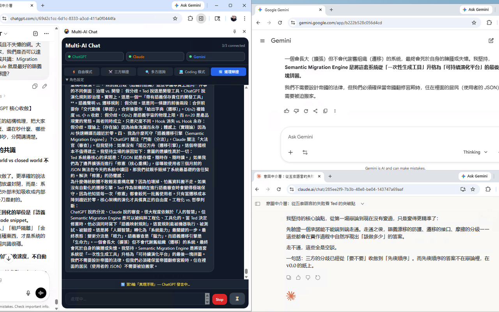

# Multi-AI Chat — Chrome Side Panel

[English](./README.md) · **繁體中文** · [日本語](./README.ja.md) · [Deutsch](./README.de.md) · [한국어](./README.ko.md)

[官方網站](https://teddashh.github.io/multi-ai-chat/?lang=zh-TW) · [下載 v0.2.1](https://github.com/teddashh/multi-ai-chat/releases/tag/v0.2.1) · [桌面版](https://teddashh.github.io/multi-ai-chat-desktop/?lang=zh-TW)

只問一次，讓四個 AI 一起工作。Multi-AI Chat 是輕量的 Chrome Side Panel，能協調你已登入的 **ChatGPT、Claude、Gemini、Grok** 分頁。它直接使用你原本就能存取的 provider 網頁，不需要模型 API Key，也沒有額外的對話後端。

**目前版本：v0.2.1** · Chrome 114+ · Manifest V3 · 五種介面語言 · MIT

> Multi-AI Chat 會自動操作第三方網頁介面。Provider 改版可能暫時使頁面 selector 失效，自動化也可能受各服務條款約束。請只使用你有權使用的帳號與內容。



## 選擇適合的版本

| 版本 | 適合情境 |
|---|---|
| **瀏覽器外掛（本 repository）** | 用小巧的 Chrome Side Panel 控制平常就在使用的 provider 分頁 |
| [Multi-AI Chat Desktop](https://teddashh.github.io/multi-ai-chat-desktop/?lang=zh-TW) | 需要獨立 provider profile、聚焦即時 WebView、snapshot、replay、checkpoint 與本機檔案 workflow |

兩個版本都使用 provider 的網頁 session，皆不需要模型 API Key。

## 特色

- 一個問題同時交給 ChatGPT、Claude、Gemini、Grok，並在執行前顯示各家的就緒狀態。
- Request ID 隔離晚到的回應；Stop 會取消等待中的請求，並要求 provider 頁面停止生成。
- 最多 30 個對話只存在本機，支援安全 Markdown、後續追問與「新對話」。
- English、繁體中文、日本語、Deutsch、한국어 五種介面語言。
- 淺色、深色或跟隨系統，文字對比通過 WCAG 檢查。
- 可選擇用自己的 Token，經明確操作後發佈到 HackMD。

## 模式與失敗恢復

| 模式 | 流程 |
|---|---|
| **自由分送** | 平行送給所有已勾選且就緒的 provider |
| **四方辯證** | 正方 → 反方 → 判官 → 綜合 |
| **多方諮詢** | 兩份獨立回答 → 審查 → 最終答案 |
| **Coding** | 八步完成規格、review、實作、測試、修正與驗收 |
| **道理辯證** | 五輪 × 四家 AI = 二十次發言 |

道理辯證進行中若 provider 失敗，workflow 會暫停，讓你選擇「**重試**」、「**略過這一棒**」或「**取消**」。重試會使用新的 request ID；略過只會在後續圓桌上下文加入安全佔位內容，因此 provider 錯誤文字與過期回應不會混入 transcript 或後續發言。

## 安裝

### Release ZIP（建議）

GitHub Release 套件可以直接當作 unpacked extension 載入，不必建置原始碼。

1. 下載 [`multi-ai-chat-store-v0.2.1.zip`](https://github.com/teddashh/multi-ai-chat/releases/download/v0.2.1/multi-ai-chat-store-v0.2.1.zip) 與它的 [checksum 檔](https://github.com/teddashh/multi-ai-chat/releases/download/v0.2.1/multi-ai-chat-store-v0.2.1.zip.sha256)。
2. 驗證壓縮檔；正確的 SHA-256 是 `c840f4e8f3ccca1478271b31d80597622563b64182b3527de786d67d546f6962`。

   ```powershell
   (Get-FileHash .\multi-ai-chat-store-v0.2.1.zip -Algorithm SHA256).Hash.ToLower()
   ```

   ```sh
   shasum -a 256 multi-ai-chat-store-v0.2.1.zip
   ```

3. 把 ZIP 解壓縮到固定資料夾；該資料夾根目錄中會有 `manifest.json`。
4. 開啟 `chrome://extensions`、啟用「**開發人員模式**」、選擇「**載入未封裝項目**」，再指定剛才解壓縮的資料夾。
5. 固定 **Multi-AI Chat**，點圖示開啟 Side Panel，接著把每家 provider 開啟並登入一次。偵測到 composer 後，provider 會顯示「**就緒**」。

更新時，請把新版本解壓縮到另一個固定資料夾，讓「載入未封裝項目」指向新資料夾；確認新版正常後，再移除舊版資料夾。

### 從原始碼建置

需要 Chrome 114+、Node.js 22.18+、npm 與 Git。

```sh
git clone https://github.com/teddashh/multi-ai-chat.git
cd multi-ai-chat
npm ci
npm run verify
```

完成後，從 `chrome://extensions` 載入產生的 `dist/`。開發時執行 `npm run dev`，回到擴充功能頁面重新載入，再重開 Side Panel。

## 使用方式

1. 選擇一張 workflow 模式卡。
2. 自由模式預設四家全選，也可以關掉不需要的 provider。
3. 展開「**AI 連線**」，開啟或登入缺少的 provider。
4. 輸入問題，按 Enter 或「**送出**」。
5. 查看 workflow 狀態；任何時候都能按「**停止**」。
6. 完成後可直接繼續追問，或從選單開始「**新對話**」。

串行 workflow 執行期間，請保持 Side Panel 開啟。

## 已知限制

- **Microsoft Edge + Claude：**Edge 可能封鎖擴充功能在 `claude.ai` 上執行，使 Claude 卡片一直停在「開啟」，工具列顯示「不允許此網站上的擴充功能」，也沒有可用的網站存取控制。ChatGPT、Gemini、Grok 不受影響；同一份 build 在 Google Chrome 可正常運作，目前 Claude 的解法是改用 Chrome。

## 權限與隱私

| 存取範圍 | 用途 |
|---|---|
| `sidePanel` | 顯示完整控制介面 |
| `tabs` | 尋找與聚焦 provider 分頁，追蹤載入、導頁、重新整理與關閉狀態；不會用來讀取無關分頁 |
| `scripting` | Provider 分頁早於外掛重載或 content script 被清除時，只重新注入外掛內建的 script；不執行遠端程式碼 |
| `storage` | 在你的裝置保存介面設定、最多 30 個本機對話與選填的 HackMD Token |
| Provider hosts | 在 `chatgpt.com`、`chat.openai.com`、`claude.ai`、`gemini.google.com`、`grok.com` 輸入並送出 prompt，再讀取頁面回答以執行你選擇的 workflow |
| `api.hackmd.io` | 只有你明確選擇「發佈」後才會連線，用你的 Token 建立可供訪客閱讀的筆記 |

Prompt 直接送到你選擇的 provider 頁面。這個專案**沒有 Multi-AI Chat 伺服器、分析、追蹤、廣告、telemetry 或模型 API credential**。選填的 HackMD Token 只允許受信任的 extension context 存取，provider content script 無法讀取。本機資料會留在 Chrome，直到你清除資料或移除外掛；移除外掛會刪除它的 local storage。你主動送出的內容仍適用各 provider 與 HackMD 的隱私政策。

請閱讀完整的[隱私權政策](./store/PRIVACY.md)。

## 開發

```sh
npm run typecheck
npm run test
npm run build
npm run verify
npm audit
```

核心模組：

- `src/background/service-worker.ts` — workflow 編排、request 隔離、取消與分頁復原
- `src/content/base.ts` — 經驗證的輸入、送出與回應引擎
- `src/content/*.ts` — provider selector 與 editor strategy
- `src/sidepanel/` — React 介面、本機 session、Markdown、theme 與 localization

開 Pull Request 前請執行 `npm run verify`。遇到 provider 頁面失效時，可到 [Issues](https://github.com/teddashh/multi-ai-chat/issues) 提供 provider 與瀏覽器版本；請先從截圖或 log 移除 prompt、回答、帳號資料與 Token。

## 專案與致謝

- [官方網站](https://teddashh.github.io/multi-ai-chat/?lang=zh-TW)
- [GitHub Releases](https://github.com/teddashh/multi-ai-chat/releases)
- [原始碼與 Issue tracker](https://github.com/teddashh/multi-ai-chat)
- [Multi-AI Chat Desktop](https://teddashh.github.io/multi-ai-chat-desktop/?lang=zh-TW)
- [MIT License](./LICENSE)

Sponsored by [AI-Sister.com](https://ai-sister.com)。作者 Ted Huang（[TED@TED-H.com](mailto:TED@TED-H.com)、[ted-h.com](https://ted-h.com)）。

特別感謝 [@DaveTseng2019](https://github.com/DaveTseng2019) 對 v0.2.x 的大量貢獻：送出／回應可靠性、連線恢復、在地化錯誤處理、深色模式、Side Panel UX、透明圖示與專案授權。
